# Systematic Outliers in Large Language Models

Official PyTorch implementation of our paper:

 **[Systematic Outliers in Large Language Models]** [[arXiv]](https://arxiv.org/abs/2312.11983) | [[OpenReview]](https://openreview.net/forum?id=rLX7Vyyzus)   
 *Yongqi An, Xu Zhao, Tao Yu, Ming Tang, Jinqiao Wang*   
 *Institute of Automation, Chinese Academy of Sciences*  

This paper systematically analyzes outliers in large language models, revealing they function as implicit context-aware scaling factors within the attention mechanism, and propose a method to eliminate them to enhance model performance and efficiency.

## Core Conclusion
- Systematic outliers consistently emerge in LLMs across various components and architectures.
<p align="center">
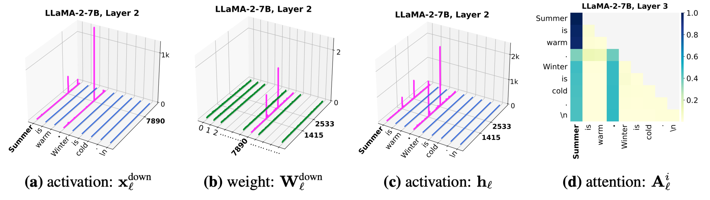
</p>
<p align="center">
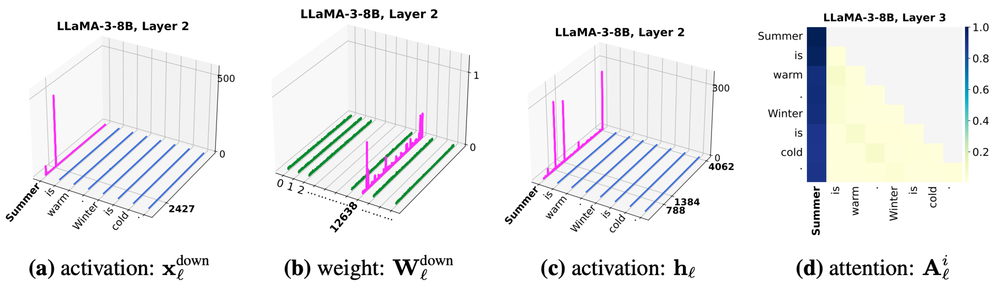
</p>
<p align="center">
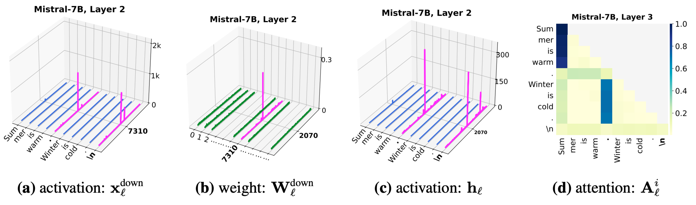
</p>
<p align="center">
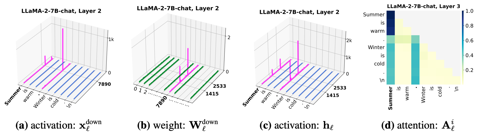
</p>

- Outliers in weights, activations, and attention are not isolated phenomena; they exhibit strong correlations across feature and sequence dimensions as well as between layers.
</p>
<p align="center">
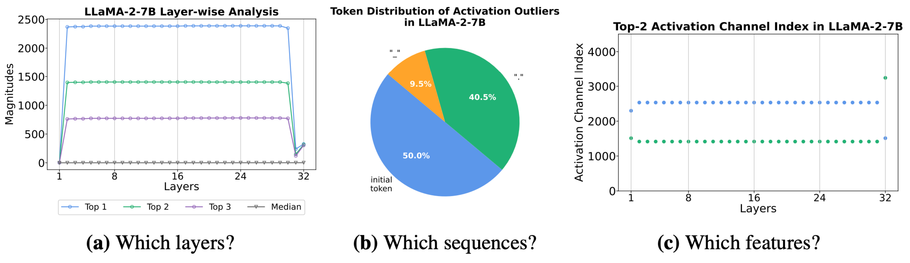
</p>
</p>
<p align="center">
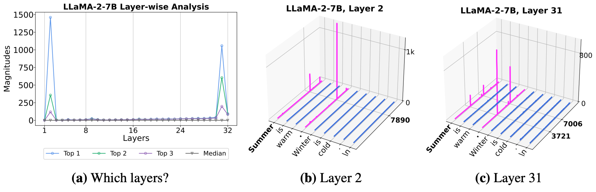
</p>
</p>
<p align="center">
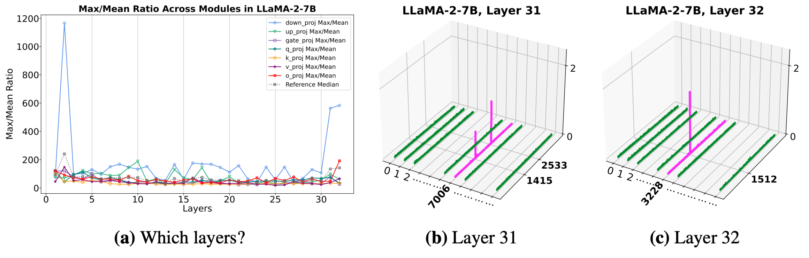
</p>
</p>
<p align="center">
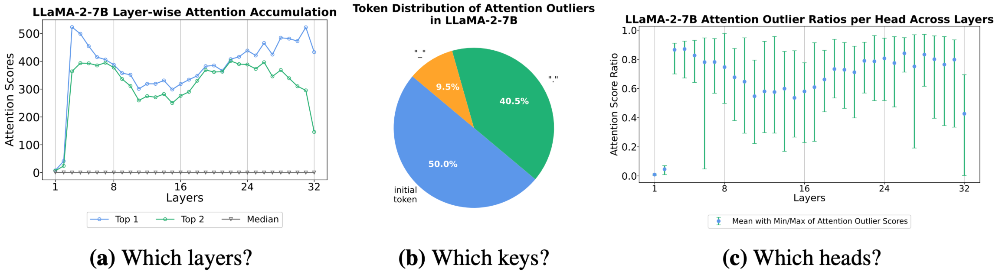
</p>

- Weight outliers lead to activation outliers, which in turn affect attention outliers. This influence extends to non-outlier tokens.
</p>
<p align="center">
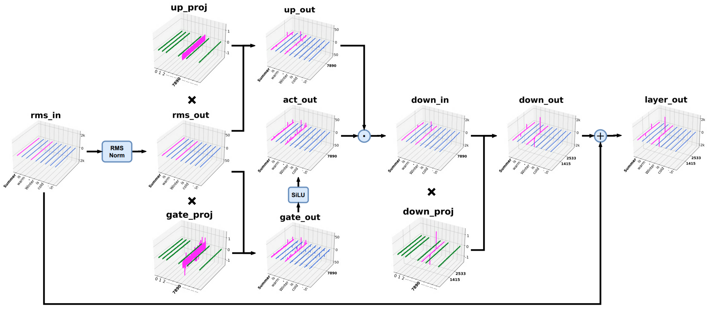
</p>
</p>
<p align="center">
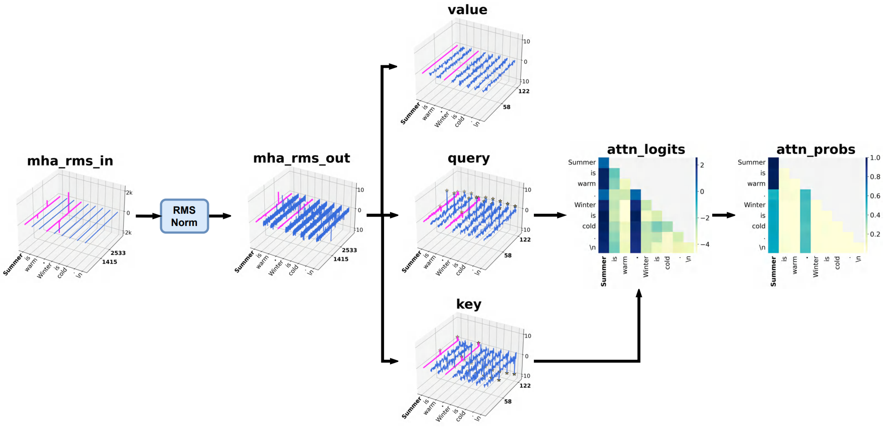
</p>
</p>
<p align="center">
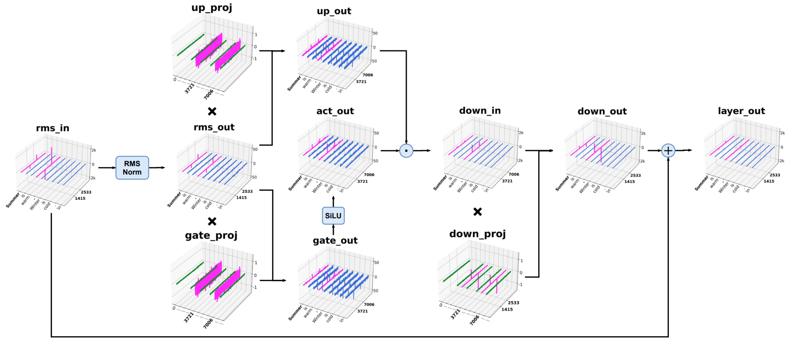
</p>

- **Systematic Outliers as Context-Aware Scaling Factors in Attention Mechanisms.** Softmax Attention is the root cause of systematic outliers.
</p>
<p align="center">
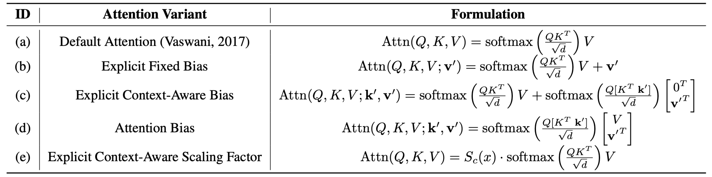
</p>
</p>
<p align="center">
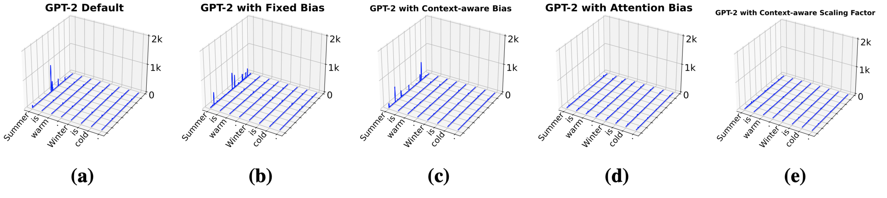
</p>

## Setup 
Installation instructions can be found in [INSTALL.md](INSTALL.md).

## Outline
The contents of this repository are as follows:

* [lib](lib) contains the util function for loading models, plotting figures and evaluation.
* [monkey_patch](monkey_patch) contains the code for monkey patching LLMs with custom forward function, with a goal of collecting internal activation and attention statistics.
* [gpt-2](gpt-2) contains the code for Training GPT-2 to validate systematic outliers hypotheses.

### Experiment Reproduction
The repository includes several Python scripts for different analyses related to systematic outliers:

#### Existence Visualization (`existence_*` scripts)
These scripts are used to visualize the existence of outliers in different components of the model (Figure 1 and Figure 13~22 in paper):
* `existence_activation_outliers_down.py`: Visualizes the existence of activation outliers in the inputs of the down-projection.
* `existence_activation_outliers_layer.py`: Analyzes and visualizes activation outliers in the outputs of the layer.
* `existence_attention_outliers.py`: Visualizes the presence of outliers within the attention scores across different attention heads and layers.
* `existence_weight_outliers.py`: Visualizes the existence of outliers in the weight matrices of the model.

#### Positional Analysis (`pos_*` scripts)
These scripts are used to visualize the specific positions where outliers occur (Figure 3~6 in paper):
* `pos_activation_outliers_down.py`: Visualizes the specific positions of activation outliers in the inputs of the down-projection.
* `pos_activation_outliers_layer_more.py`: Visualizes the specific positions of activation outliers in the outputs of the layer
* `pos_attention_outliers.py`: Visualizes the specific positions of attention score outliers within the attention mechanism.
* `pos_weight_outliers.py`: Identifies the specific positions of outliers in the weight matrices.

#### Lifecycle Analysis (`lifecycle_*` scripts)
These scripts are used to analyze the lifecycle of outliers, from their formation to disappearance (Figure 7~9 in paper):
* `lifecycle_emergence.py`: Analyzes the emergence of activation outliers from weight outliers.
* `lifecycle_spread.py`: Visualizes the spread of attention outliers from activation outliers.
* `lifecycle_disappearance.py`: Analyzes the disappearance of outliers in the final layers.

#### Hypothesis Verification (`gpt-2/*`)
You can see the [README.md](gpt-2/README.md) in gpt-2. You can train and analysis the gpt-2 to validate the role of systematic outliers in LLMs. (Figure 10, 11, 23)

## License
This project is released under the MIT license. Please see the [LICENSE](LICENSE) file for more information.

## Reference 
```bibtex
```